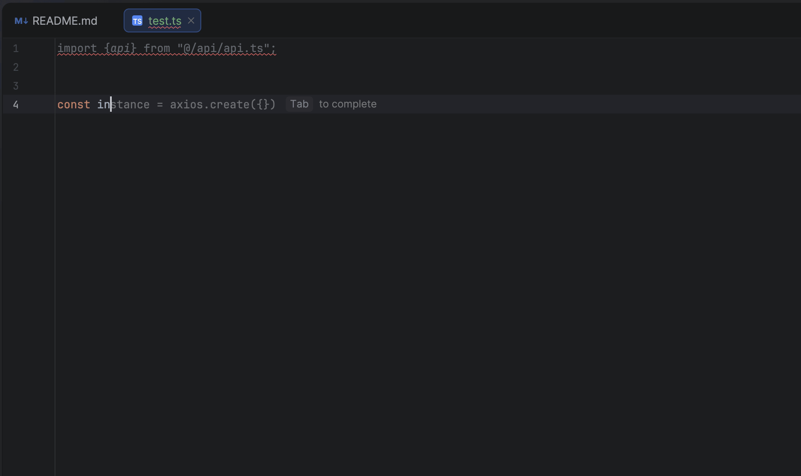

# Laravel tRPC

[](https://packagist.org/packages/oybek-daniyarov/laravel-trpc)
[](https://packagist.org/packages/oybek-daniyarov/laravel-trpc)
[](https://packagist.org/packages/oybek-daniyarov/laravel-trpc)

> End-to-end type-safe APIs for Laravel. Like tRPC, but for Laravel + TypeScript.

> **Built with AI.** This package was developed using [Claude Code](https://claude.ai/code) — architected and directed by a human, implemented by AI. Use at your own risk. [Read the backstory](#backstory).

Generate a fully typed TypeScript client from your Laravel routes with zero runtime overhead. Get autocomplete for route names, request bodies, response types, and URL parameters.



## Features

- **Full Type Safety**: Request bodies, responses, URL parameters, and query strings are all typed
- **Zero Runtime Overhead**: Types are generated at build time, no runtime reflection
- **Framework Integrations**: Built-in support for React Query and Inertia.js
- **Grouped API Client**: Object-based API (`api.users.show()`) with full autocomplete
- **Postman Export**: Generate Postman collections from your routes

## Example Project

See it in action — a Laravel API with Inertia.js frontend, fully typed end-to-end:

🔗 [github.com/oybek-daniyarov/empty-space](https://github.com/oybek-daniyarov/empty-space)

## Table of Contents

- [Example Project](#example-project)
- [Requirements](#requirements)
- [Installation](#installation)
- [Quick Start](#quick-start)
- [TypedRoute Attribute](#typedroute-attribute)
- [Generate & Use](#generate--use)
- [Generated Files](#generated-files)
- [Configuration](#configuration)
- [Middleware & Authentication](#middleware--authentication)
- [Error Handling](#error-handling)
- [Type Helpers](#type-helpers)
- [React Query Integration](#react-query-integration)
- [Inertia.js Integration](#inertiajs-integration)
- [API Client Configuration](#api-client-configuration)
- [Command Options](#command-options)
- [Customizing Stubs](#customizing-stubs)
- [Backstory](#backstory)

## Requirements

- PHP 8.2+
- Laravel 11.x or 12.x
- [spatie/laravel-data](https://spatie.be/docs/laravel-data)
- [spatie/laravel-typescript-transformer](https://spatie.be/docs/typescript-transformer)

## Installation

```bash
composer require spatie/laravel-data spatie/laravel-typescript-transformer
composer require oybek-daniyarov/laravel-trpc
```

Publish the config file:

```bash
php artisan vendor:publish --tag=trpc-config
```

## Quick Start

### 1. Define Data Classes

```php
use Spatie\LaravelData\Data;
use Spatie\TypeScriptTransformer\Attributes\TypeScript;

#[TypeScript]
class UserData extends Data
{
    public function __construct(
        public int $id,
        public string $name,
        public string $email,
    ) {}
}

#[TypeScript]
class CreateUserData extends Data
{
    public function __construct(
        public string $name,
        public string $email,
        public string $password,
    ) {}
}
```

### 2. Add TypedRoute Attribute to Controllers

```php
use OybekDaniyarov\LaravelTrpc\Attributes\TypedRoute;

class UserController extends Controller
{
    #[TypedRoute(response: UserData::class, isPaginated: true)]
    public function index()
    {
        return UserData::collect(User::paginate());
    }

    #[TypedRoute(response: UserData::class)]
    public function show(User $user)
    {
        return UserData::from($user);
    }

    #[TypedRoute(request: CreateUserData::class, response: UserData::class)]
    public function store(CreateUserData $data)
    {
        return UserData::from(User::create($data->toArray()));
    }

    #[TypedRoute(request: UpdateUserData::class, response: UserData::class)]
    public function update(User $user, UpdateUserData $data)
    {
        $user->update($data->toArray());
        return UserData::from($user);
    }

    #[TypedRoute]
    public function destroy(User $user)
    {
        $user->delete();
        return response()->noContent();
    }
}
```

## TypedRoute Attribute

The `#[TypedRoute]` attribute explicitly declares request and response types for your API endpoints. When applied, it takes priority over static analysis for type detection.

### Parameters

| Parameter | Type | Description |
|-----------|------|-------------|
| `request` | `class-string\|null` | Request body Data class (for POST/PUT/PATCH) |
| `query` | `class-string\|null` | Query parameters Data class (for GET requests) |
| `response` | `class-string\|null` | Response Data class |
| `errorResponse` | `class-string\|null` | Error response Data class (defaults to ValidationError) |
| `isCollection` | `bool` | Response is an array of items (`Array<T>`) |
| `isPaginated` | `bool` | Response is paginated (`PaginatedResponse<T>`) |

### Examples

**Basic response type:**
```php
#[TypedRoute(response: UserData::class)]
public function show(User $user)
{
    return UserData::from($user);
}
```

**Request and response types:**
```php
#[TypedRoute(request: CreateUserData::class, response: UserData::class)]
public function store(CreateUserData $data)
{
    return UserData::from(User::create($data->toArray()));
}
```

**Query parameters (for GET with filters/search):**
```php
#[TypedRoute(query: UserFilterData::class, response: UserData::class, isPaginated: true)]
public function index(UserFilterData $filters)
{
    return UserData::collect(
        User::filter($filters)->paginate()
    );
}
```

**Paginated response:**
```php
#[TypedRoute(response: UserData::class, isPaginated: true)]
public function index()
{
    return UserData::collect(User::paginate());
}
// TypeScript: PaginatedResponse<UserData>
```

**Collection response (non-paginated array):**
```php
#[TypedRoute(response: UserData::class, isCollection: true)]
public function all()
{
    return UserData::collect(User::all());
}
// TypeScript: Array<UserData>
```

**No response body (204 No Content):**
```php
#[TypedRoute]
public function destroy(User $user)
{
    $user->delete();
    return response()->noContent();
}
// TypeScript: void
```

**Custom error response:**
```php
#[TypedRoute(
    request: CreateUserData::class,
    response: UserData::class,
    errorResponse: CreateUserErrorData::class
)]
public function store(CreateUserData $data)
{
    // ...
}
```

### Query vs Request

- Use `request` for **body data** (POST, PUT, PATCH requests)
- Use `query` for **URL query parameters** (GET requests with filters, search, pagination)

```php
// GET /api/users?status=active&sort=name
#[TypedRoute(query: UserFilterData::class, response: UserData::class, isPaginated: true)]
public function index(UserFilterData $filters) { }

// POST /api/users (body: { name: "John", email: "john@example.com" })
#[TypedRoute(request: CreateUserData::class, response: UserData::class)]
public function store(CreateUserData $data) { }
```

## Generate & Use

### Generate TypeScript Client

```bash
php artisan trpc:generate
```

### 4. Use in TypeScript

```typescript
import { api } from '@/api';

// Full autocomplete and type safety
const users = await api.users.index();
const user = await api.users.show({ user: 1 });
const newUser = await api.users.store({
    name: 'John',
    email: 'john@example.com',
    password: 'secret'
});
await api.users.update({ user: 1 }, { name: 'Jane' });
await api.users.destroy({ user: 1 });
```

## Generated Files

| File | Description |
|------|-------------|
| `types.ts` | Core types (HttpMethod, ApiError, PaginatedResponse, ValidationError) |
| `routes.ts` | Route definitions, RouteTypeMap, method-filtered route types |
| `helpers.ts` | Type helpers (RequestOf, ResponseOf, ParamsOf, QueryOf) |
| `url-builder.ts` | Type-safe URL builder with query string support |
| `fetch.ts` | Low-level fetch wrapper with full type safety |
| `client.ts` | Configurable API client factory with method-specific calls |
| `api.ts` | Grouped API client (`api.users.show()`) |
| `queries.ts` | React Query hooks organized by resource |
| `react-query.ts` | React Query utilities (queryKey, createQueryOptions) |
| `inertia.ts` | Inertia.js helpers (route, visit, formAction) |
| `index.ts` | Barrel exports |
| `README.md` | Generated documentation |

## Configuration

```php
// config/trpc.php
return [
    // Output directory for generated files
    'output_path' => resource_path('js/api'),

    // API route prefix filter
    'api_prefix' => 'api',

    // Route collection mode: 'api', 'web', 'all', 'named', 'attributed'
    'route_mode' => 'api',

    // Exclude patterns
    'exclude_patterns' => [
        'debugbar.*',
        'horizon.*',
        'telescope.*',
    ],

    // Output files to generate
    'outputs' => [
        'routes' => true,
        'types' => true,
        'helpers' => true,
        'url-builder' => true,
        'fetch' => true,
        'client' => true,
        'index' => true,
        'readme' => true,
        'grouped-api' => true,
        'inertia' => true,
        'react-query' => false,
        'queries' => false,
    ],
];
```

### Configuration Reference

| Option | Type | Default | Description |
|--------|------|---------|-------------|
| `output_path` | string | `resource_path('js/api')` | Directory for generated TypeScript files |
| `api_prefix` | string | `'api'` | API route prefix for filtering |
| `version` | string | `'v1'` | API version identifier |
| `route_mode` | string | `'api'` | Route collection mode (see below) |
| `include_patterns` | array | `[]` | Route patterns to include |
| `exclude_patterns` | array | `[...]` | Route patterns to exclude |
| `exclude_methods` | array | `['options', 'head']` | HTTP methods to skip |
| `preset` | string\|null | `null` | Framework preset: `'inertia'`, `'api'`, `'spa'` |
| `outputs` | array | `[...]` | Files to generate |
| `auto_typescript_transform` | bool | `true` | Auto-run `typescript:transform` |
| `laravel_types_path` | string\|null | `null` | Path to `laravel.d.ts` |

### Route Modes

| Mode | Description |
|------|-------------|
| `'api'` | Only routes starting with `api_prefix` (default) |
| `'web'` | Only routes NOT starting with `api_prefix` |
| `'all'` | All routes (use with include/exclude patterns) |
| `'named'` | Only routes with names |
| `'attributed'` | Only routes with `#[TypedRoute]` attribute |

### Presets

Use presets to quickly enable common output configurations:

```php
// config/trpc.php
return [
    'preset' => 'spa', // 'inertia', 'api', or 'spa'
];
```

| Preset | Enables | Use Case |
|--------|---------|----------|
| `'inertia'` | Core files + Inertia helpers | Laravel + Inertia.js apps |
| `'api'` | Core files + React Query | API-first / SPA with React Query |
| `'spa'` | Core files + Inertia + React Query | Full-featured SPA |
| `null` | Custom (configure `outputs` manually) | Fine-grained control |

Presets override the `outputs` array. To customize individual outputs, set `preset` to `null` and configure `outputs` directly.

### Postman Configuration

```php
'postman' => [
    'output_path' => storage_path('app/postman'),
    'collection_name' => env('APP_NAME', 'API').' Collection',
    'base_url' => '{{base_url}}',
    'auth_type' => 'bearer', // 'bearer', 'apikey', or null
    'default_headers' => [],
],
```

## Middleware & Authentication

The generated routes include middleware information, allowing you to build auth-aware UIs.

### Generated Route Data

Each route includes middleware and authentication info:

```typescript
// In routes.ts
export const routes = {
    'users.index': {
        path: 'api/users',
        method: 'get',
        params: [],
        middleware: ['auth:sanctum', 'verified'] as const,
        authenticated: true,
    },
    'auth.login': {
        path: 'api/auth/login',
        method: 'post',
        params: [],
        middleware: [] as const,
        authenticated: false,
    },
} as const;
```

### Type Helpers for Auth Routes

Filter routes by authentication requirement:

```typescript
import type { AuthenticatedRoutes, PublicRoutes } from '@/api';

// Only routes that require authentication
type ProtectedRoutes = AuthenticatedRoutes;
// 'users.index' | 'users.store' | 'users.update' | ...

// Only routes that don't require authentication
type OpenRoutes = PublicRoutes;
// 'auth.login' | 'auth.register' | ...
```

### Checking Auth Before API Calls

```typescript
import { routes, type RouteName } from '@/api';

function isAuthRequired(name: RouteName): boolean {
    return routes[name].authenticated;
}

// Use in components
function ApiButton({ route, children }: { route: RouteName; children: React.ReactNode }) {
    const { isAuthenticated } = useAuth();

    if (routes[route].authenticated && !isAuthenticated) {
        return <LoginPrompt />;
    }

    return <button onClick={() => callApi(route)}>{children}</button>;
}
```

### Accessing Middleware Array

```typescript
import { routes } from '@/api';

// Get middleware for a route
const middleware = routes['users.index'].middleware;
// ['auth:sanctum', 'verified']

// Check for specific middleware
const requiresVerification = middleware.includes('verified');
```

## Error Handling

### Built-in Error Types

The generated `types.ts` includes standard Laravel error types:

```typescript
// Base API error (thrown by fetch wrapper)
interface ApiError {
    readonly message: string;
    readonly status: number;        // HTTP status code
    readonly statusText?: string;   // HTTP status text
    readonly errors?: Record<string, string[]>;  // Validation errors
}

// Specific error types
interface ValidationError { message: string; errors: Record<string, string[]>; }
interface NotFoundError { message: string; }
interface UnauthorizedError { message: string; }
interface ForbiddenError { message: string; }
interface ServerError { message: string; exception?: string; trace?: [...]; }
```

### Custom Error Types with `errorResponse`

Define custom error Data classes for specific routes:

```php
// Define a custom error type
#[TypeScript]
class CreateUserErrorData extends Data
{
    public function __construct(
        public string $message,
        public ?string $email_suggestion,  // Custom field
        public ?array $password_requirements,
    ) {}
}

// Use in controller
#[TypedRoute(
    request: CreateUserData::class,
    response: UserData::class,
    errorResponse: CreateUserErrorData::class  // Custom error type
)]
public function store(CreateUserData $data)
{
    // If validation fails, return custom error structure
    if (User::where('email', $data->email)->exists()) {
        return response()->json([
            'message' => 'Email already taken',
            'email_suggestion' => $data->email . '.new',
        ], 422);
    }

    return UserData::from(User::create($data->toArray()));
}
```

### Using Error Types in TypeScript

```typescript
import type { ErrorOf, ApiError } from '@/api';
import { api } from '@/api';

// Get the error type for a specific route
type CreateUserError = ErrorOf<'users.store'>;
// CreateUserErrorData (custom) or ValidationError (default)

// Handle errors with proper typing
async function createUser(data: CreateUserData) {
    try {
        return await api.users.store(data);
    } catch (e) {
        const error = e as ApiError;

        console.log(error.status);     // 422
        console.log(error.message);    // "Email already taken"
        console.log(error.errors);     // { email: ["Email already taken"] }

        // For custom error fields, cast to specific type
        if (error.status === 422) {
            const customError = error as unknown as CreateUserError;
            console.log(customError.email_suggestion);
        }
    }
}
```

### Error Handling with React Query

```typescript
import { useMutation } from '@tanstack/react-query';
import type { ErrorOf, ApiError } from '@/api';

function CreateUserForm() {
    const mutation = useMutation({
        mutationFn: (data) => api.users.store(data),
        onError: (error: ApiError) => {
            if (error.status === 422 && error.errors) {
                // Show field-specific errors
                Object.entries(error.errors).forEach(([field, messages]) => {
                    setFieldError(field, messages[0]);
                });
            } else if (error.status === 401) {
                redirectToLogin();
            }
        },
    });

    // ...
}
```

## Type Helpers

Extract types from route names for use in your components:

```typescript
import type { RequestOf, ResponseOf, ParamsOf, QueryOf, ErrorOf } from '@/api';

// Request body type
type CreateUserPayload = RequestOf<'users.store'>;

// Response type
type UserResponse = ResponseOf<'users.show'>;

// URL parameters type
type UserParams = ParamsOf<'users.show'>; // { user: number }

// Query parameters type
type UserQuery = QueryOf<'users.index'>; // { page?: number, per_page?: number }

// Error type (custom or ValidationError)
type StoreUserError = ErrorOf<'users.store'>;
```

## React Query Integration

Enable in config:

```php
'outputs' => [
    'react-query' => true,  // Core utilities (queryKey, createQueryOptions)
    'queries' => true,      // Resource-based query hooks (usersQueries, etc.)
],
```

### Generated Files

| File | Description |
|------|-------------|
| `react-query.ts` | Low-level utilities: `queryKey`, `createQueryOptions`, `createInfiniteQueryOptions`, `createMutationOptions` |
| `queries.ts` | Resource-based query factories organized by API resource (e.g., `usersQueries`, `postsQueries`) |

### Resource-Based Queries (`queries.ts`)

The `queries.ts` file generates query factories for each API resource, providing:
- Pre-configured `queryOptions()` and `infiniteQueryOptions()` for each GET endpoint
- Type-safe query keys with `keys` object for cache management
- Automatic infinite query support for paginated endpoints

```typescript
import { useQuery, useInfiniteQuery, useQueryClient } from '@tanstack/react-query';
import { usersQueries, postsQueries } from '@/api';

// Simple query
const { data: user } = useQuery(usersQueries.show({ user: 1 }));

// Paginated endpoints automatically use infinite queries
const { data, fetchNextPage, hasNextPage } = useInfiniteQuery(
    usersQueries.index({ query: { per_page: 20 } })
);

// Query keys for cache invalidation
const queryClient = useQueryClient();
queryClient.invalidateQueries({ queryKey: usersQueries.keys.all });        // ['users']
queryClient.invalidateQueries({ queryKey: usersQueries.keys.show({ user: 1 }) }); // ['users', 'show', { user: 1 }]
```

### Low-Level Utilities (`react-query.ts`)

For more control, use the low-level utilities:

```typescript
import { useQuery, useMutation } from '@tanstack/react-query';
import { queryKey, createQueryOptions, createMutationOptions } from '@/api';

// Create query options manually
const { data } = useQuery(
    createQueryOptions('users.show', {
        path: { user: 1 },
        staleTime: 5000,
    })
);

// Query keys for cache management
const key = queryKey('users.show', { path: { user: 1 } });
// ['users.show', { user: 1 }, undefined]

// Mutations
const mutation = useMutation(createMutationOptions('users.store'));
mutation.mutate({ body: { name: 'John', email: 'john@example.com' } });
```

### Full Example

```typescript
import { useQuery, useMutation, useQueryClient } from '@tanstack/react-query';
import { usersQueries, api } from '@/api';

function UserProfile({ userId }: { userId: number }) {
    const { data, isLoading } = useQuery(usersQueries.show({ user: userId }));
    const queryClient = useQueryClient();

    const updateUser = useMutation({
        mutationFn: (data) => api.users.update({ user: userId }, data),
        onSuccess: () => {
            queryClient.invalidateQueries({
                queryKey: usersQueries.keys.show({ user: userId })
            });
        },
    });

    if (isLoading) return <div>Loading...</div>;

    return (
        <div>
            <h1>{data?.name}</h1>
            <button onClick={() => updateUser.mutate({ name: 'New Name' })}>
                Update
            </button>
        </div>
    );
}
```

### Infinite Queries for Pagination

Paginated endpoints automatically generate `infiniteQueryOptions`:

```typescript
import { useInfiniteQuery } from '@tanstack/react-query';
import { usersQueries } from '@/api';

function UserList() {
    const { data, fetchNextPage, hasNextPage, isFetchingNextPage } = useInfiniteQuery(
        usersQueries.index({ query: { per_page: 20 } })
    );

    return (
        <div>
            {data?.pages.flatMap(page => page.data).map(user => (
                <div key={user.id}>{user.name}</div>
            ))}
            {hasNextPage && (
                <button
                    onClick={() => fetchNextPage()}
                    disabled={isFetchingNextPage}
                >
                    {isFetchingNextPage ? 'Loading...' : 'Load More'}
                </button>
            )}
        </div>
    );
}
```

## Inertia.js Integration

```typescript
import { router } from '@inertiajs/react';
import { route, visit, formAction } from '@/api/inertia';

// Generate type-safe URLs
const url = route('users.show', { user: 123 });

// Navigate with type safety
visit('users.show', { user: 123 });
visit('users.index', null, { query: { page: 2 } });

// Form actions
function CreateUserForm() {
    return (
        <form {...formAction('users.store')}>
            <input name="name" />
            <input name="email" type="email" />
            <button type="submit">Create</button>
        </form>
    );
}
```

## API Client Configuration

### Default Usage

The default `api` object uses relative URLs and works with Laravel's session/cookie authentication:

```typescript
import { api } from '@/api';

const users = await api.users.index();
```

### Custom Base URL

Use `createApi` to point to a different API URL (staging, production, external API):

```typescript
import { createApi } from '@/api';

// Configure for your environment
const api = createApi({
    baseUrl: import.meta.env.VITE_API_URL,  // Vite
    // baseUrl: process.env.NEXT_PUBLIC_API_URL,  // Next.js
    headers: {
        Authorization: `Bearer ${token}`,
    },
    onError: (error) => {
        if (error.status === 401) {
            window.location.href = '/login';
        }
    },
});

const users = await api.users.index();
```

### Server-Side Usage (Next.js)

```typescript
// lib/api.server.ts
import { createApi } from '@/api';

export const serverApi = createApi({
    baseUrl: process.env.API_URL!,
    headers: {
        Authorization: `Bearer ${process.env.API_TOKEN}`,
    },
});

// app/users/page.tsx
import { serverApi } from '@/lib/api.server';

export default async function UsersPage() {
    const users = await serverApi.users.index();
    return <UserList users={users.data} />;
}
```

## Command Options

```bash
# Generate TypeScript definitions (default)
php artisan trpc:generate

# Generate Postman collection only
php artisan trpc:generate --postman

# Generate both TypeScript and Postman collection
php artisan trpc:generate --format=all

# Custom output directory (overrides config)
php artisan trpc:generate --output=resources/js/generated

# Override API prefix for route filtering
php artisan trpc:generate --api-prefix=api/v2

# Skip running typescript:transform automatically
php artisan trpc:generate --skip-typescript-transform

# Generate Postman collection with environment file
php artisan trpc:generate --postman --postman-env

# Overwrite files without confirmation
php artisan trpc:generate --force
```

### Command Options Reference

| Option | Description |
|--------|-------------|
| `--output=PATH` | Override the output directory from config |
| `--api-prefix=PREFIX` | Override the API route prefix filter |
| `--skip-typescript-transform` | Skip auto-running `typescript:transform` |
| `--postman` | Generate Postman collection only (shorthand for `--format=postman`) |
| `--postman-env` | Also generate Postman environment file |
| `--format=FORMAT` | Output format: `typescript` (default), `postman`, or `all` |
| `--force` | Overwrite existing files without confirmation |

## Customizing Stubs

Publish the stub templates:

```bash
php artisan vendor:publish --tag=trpc-stubs
```

Templates will be copied to `resources/views/vendor/trpc/`.

## Backstory

Every line of code in this package was generated by [Claude](https://claude.ai) through [Claude Code](https://claude.ai/code).

Here's how it worked:

1. **Skills Discovery** — I asked Claude what skills were needed to build this package
2. **Actor Creation** — For each skill area (architecture, TypeScript generation, testing, etc.), I created specialized agents
3. **Scope Definition** — I defined what each agent should build and what quality criteria to meet
4. **Orchestration** — I ran agents (sometimes 16 in parallel), reviewed outputs, and course-corrected

I didn't write the code — I architected, directed, and reviewed it. When things broke, I asked the right questions. When tests failed, I debugged by asking, not coding. The AI implemented; I directed.

The package has 239 passing tests and works. But it was built as an experiment in AI-directed development. Future updates will continue the same way — directed by me, implemented by Claude.

Found a bug? Open an issue. I'll point Claude at it.

## License

MIT License. See [LICENSE](LICENSE.md) for details.

## Credits

- [Oybek Daniyarov](https://github.com/oybek-daniyarov)
- [Claude](https://claude.ai) by Anthropic — the AI that wrote the code
- [Spatie](https://spatie.be) for laravel-data and typescript-transformer
- [Laravel](https://laravel.com) team for Wayfinder, which inspired some of the thinking here
